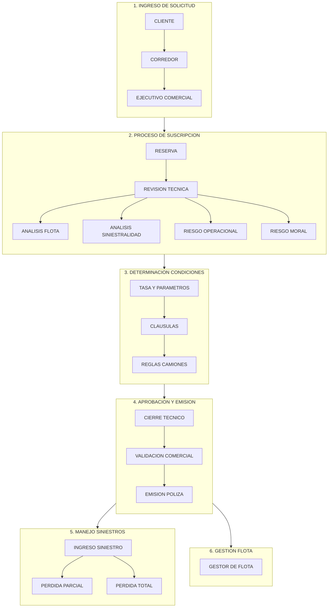
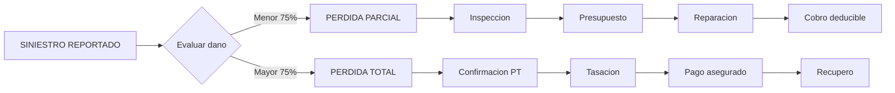
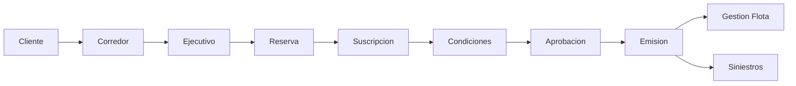

# Flujo de Suscripcion de Vehiculos - Flotas

## Diagrama General del Proceso

## Detalle por Etapa

### 1. Ingreso de Solicitud

| Actor | Informacion |
|-------|-------------|
| Cliente | RUT empresa, Tipo flota, Cantidad unidades, Historial siniestros 3-5 anos, Rutas y zonas riesgo, Controles internos |
| Corredor | Solicitud formal, Cuadro comparativo flota, Analisis siniestralidad, Propuesta deducibles |
| Ejecutivo Comercial | Ingreso al sistema, Crea reserva, Revisa otros ramos, Pre-chequeo reglas |

### 2. Analisis del Suscriptor

| Tipo Analisis | Elementos |
|---------------|-----------|
| Info Flota | Antiguedad, Tipologia, GPS y Telemetria, Propios vs Leasing |
| Siniestralidad | Frecuencia, Severidad, PT vs Parciales, Tendencias |
| Riesgo Operacional | Tipo carga, Zonas criticas, Rutas, Conductores |
| Riesgo Moral | Estabilidad, Fraude, Conducta pago |

## Flujo de Siniestros

## KPIs de Suscripcion

| Metrica | Formula | Valor Aceptable |
|---------|---------|-----------------|
| Frecuencia | Siniestros / Vehiculos | Menor a 15% |
| Severidad | Monto total / Siniestros | Controlada |
| PT vs Parciales | PT / Total perdidas | Menor a 25% |

## Resumen Visual

